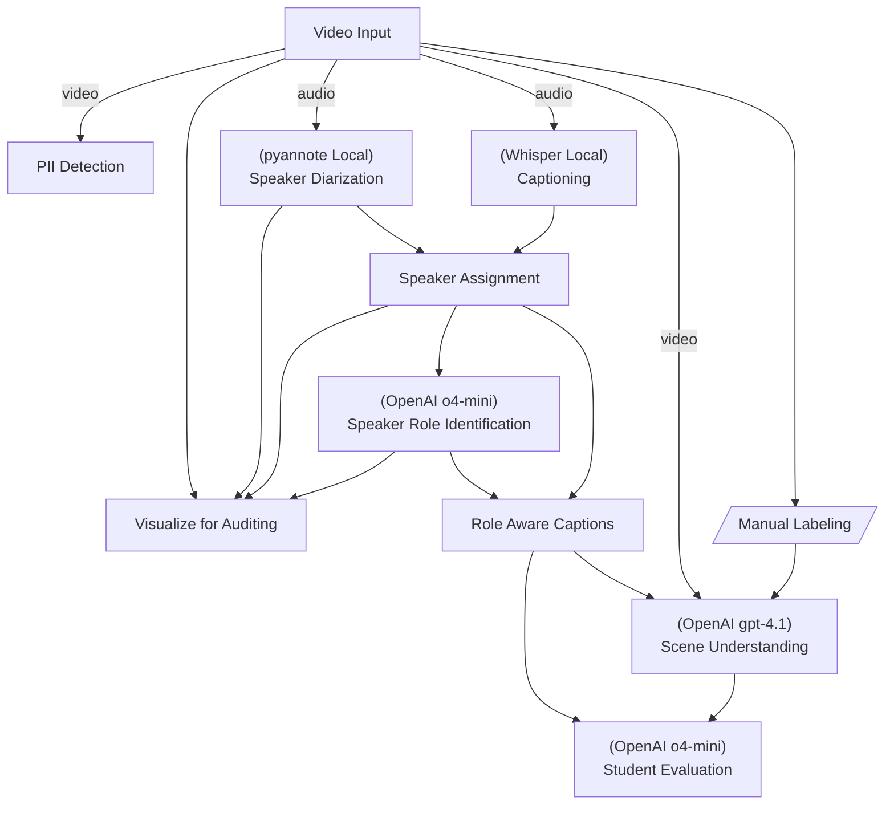

# Video Summarizer

## Project Overview

This repository hosts two closely related projects designed to build a scalable video-understanding and summarization pipeline.

1. **[Flow](./src/flow/README.md)**

   A user-friendly DAG-based workflow manager that offers task resumption, caching, logging, error handling, and persistence, ensuring efficient and fault-tolerant execution of machine learning pipelines.

2. **[Video Summarizer](./src/video_summarizer/README.md)**

   A video understanding and summarization system that can be used to automatically summarize hours of technical video into 5-minute digest with explanations.

Here is the main video processing flow this implements.



### Related Project

- **[Video Annotator](https://github.com/hirak99/video-annotator)**

  It is a web-based tool for manual video annotation, to annotate lattice-aligned rectangular ROIs in the videos. It was primarily made for this project to quickly annotate map the teacher / student areas. It is also used to mark simple regions for adhoc blurring.

## Setup & Running

### Setup

- Recommended Python version is 3.13.

If your default Python version is lower, and you are using Debian based distro (Ubuntu / Mint etc.), you can use the following commands to install Python 3.13 -

```sh
sudo apt install python3.13 python3.13-venv python3.13-dev
```

- Create a venv (with Python 3.13 or higher) and install these packages:
```sh
# Python dependencies.
pip install -r requirements.txt

# Linux dependencies.
sudo apt install tesseract-ocr
```
- Put all your videos in a path and edit video_processor.py to point to it.
- Obtain a token from HuggingFace to use public domain models that require authentication.
- Install ffmpeg.

### Manual Labeling

Manual labels are done using [Video Annotator](https://github.com/hirak99/video-annotator).

See the constants in [manual_labels_manager.py](./src/video_summarizer/utils/manual_labels_manager.py) for conventions used (e.g. where the labels are stored, etc.).

### Local LLM Inference
For running local LLM models, following additional steps are required.

Skip if you don't need local infernce, and if you plan to use cloud-based LLMs.

```sh
sudo apt install cmake libcurl4-openssl-dev

# This requires an interactive prompt with EULA to be accepted.
sudo apt install ttf-mscorefonts-installer

# Install or update CUDA. E.g. for WSL-Ubuntu, follow instructions here -
# https://developer.nvidia.com/cuda-downloads?target_os=Linux&target_arch=x86_64&Distribution=WSL-Ubuntu&target_version=2.0&target_type=deb_network
# Important - add the new cuda to path. E.g. -
# PATH="/usr/local/cuda-12.9/bin:$PATH"

cd ~/git
git clone https://github.com/ggerganov/llama.cpp
cd llama.cpp
cmake -B build -DGGML_CUDA=ON
cmake --build build --config Release -j 8
```

Then download the models you need into `~/data/models`.

Note: To ensure that the local instance is automatically started when needed,
ensure that you have`AUTO_START_SERVER = True` in llm.py.
### Run the code
```sh
export FFMPEG_BINARY=/usr/bin/ffmpeg

# Note: The keys below may also be put in a .env file instead.

# Note: Remember to also accept pyannote terms of service in HuggingFace.
export HUGGING_FACE_AUTH="your huggingface token"
export OPEN_API_KEY="your OpenAI key"

# Edit consts in video_config.py.
# - Set input/output paths. If you modify them, also change the video_process.sh script.
# - Make sure TESTING_MODE is False.

# Set source videos to summarize in domain_config.py.

# If using local LLMs, edit llm.py.
# - Set AUTO_START_SERVER to True. This will allow the framework to manage the local GPU
#   and start the local LLM services as needed.

# Then you can run a binary like below.

# Run each video file through video-understanding flow.
./scripts/video_flow.sh

# Run the student highlight compilation flow.
./scripts/student_flow.sh
```

## Real-Life Usage

This project originally began as a [private project](https://github.com/hirak99/process_graph) (restricted access).

After extracting the domain-specific data, the first public release was made with over 280 commits squashed into a single release.

The parent project now includes this repository as a submodule, while overriding the domain-specific data.
