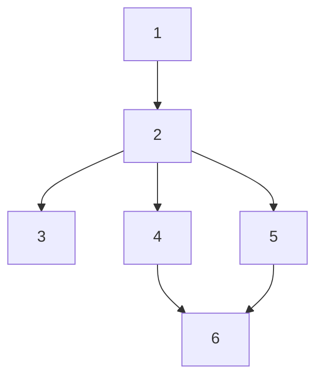

# Flow: A general purpose ML workflow manager

Process graphs offers persistence, extensibility, generalization and ease of use in building offline ML training and inference workflows.

Example -

```python
from flow import process_graph
from flow import process_node

# Define a node. Nodes may initialize and reuse models (not shown here), but should strive to be stateless.
class SumInt(process_node.Processor):
    def process(self, a: int, b: int) -> int:
        return a + b
```

Usage -
```python
graph = process_graph.ProcessGraph()

node_const = graph.add_constant_node(id=0, name="MyConst")
node1 = graph.add_node(1, SumInt, {"a": node_const, "b": 200})
node2 = graph.add_node(2, SumInt, {"a": 300, "b": node1})

node_const.set_value(100)
result = graph.run_upto(node2)  # 600
```

More complicated flows can be written, as the example bellow. ML pipelines using this can be iterated, extended, and built incrementally.

## Core Classes

For full documentation, please also see the code.

### The `ProcessGraph` Class

([Code](./process_graph.py))


The `ProcessGraph` class manages the workflow execution. Key methods include:

- `persist(path: str)`: Specifies the path for persisting node states to disk.
- `add_node(node_id: int, processor_class: Type[process_node.Processor], inputs: Dict)`: Adds a node to the graph. `node_id` must be unique. `processor_class` is the class of the processor for this node and `inputs` are the input arguments, which can be either concrete values or references to other nodes.
    - Note: To pass constructor args, use `node_init_kwargs=dict(arg=value)` in add_node.
- `run_upto(node: process_node.Processor)`: Executes the graph up to the specified node, including all its dependencies.
- `release_resources()`: Releases resources held by all nodes in the graph.
- `topological_sort(target_node: process_node.Processor)`: Returns a topologically sorted list of nodes that will be run in order to compute the `target_node`.

### The `process_node.Processor` Class

([Code](./process_node.py))

Nodes in the graph are implemented as subclasses of `process_node.Processor`.  The core method is:

- `process(...) -> Any`: This method defines the computation performed by the node. Specify arguments by name, such as `process(self, video_file: str, diarization: dict[str, Any]) -> str`. It receives keyword arguments based on the `inputs` specified in `add_node`. A runtime check ensures that the `inputs` match keyword and type declared in `process(...)`.

## Batch Optimizations

Some optimizations that batch processing handles is given below.

You can take advantage of these via the `graph.batch_process(...)` method.

```python
graph = process_graph.ProcessGraph()

node_const = graph.add_constant_node(id=0, name="MyConst")
node1 = graph.add_node(1, SumInt, {"a": node_const, "b": 200})

def prep_fn(index: int, item: Any) -> None:
    # Initialize constants based on the item.
    nodes[0].set_value(item)
    # You must persist the data for batch running.
    graph.persist(f"persist_file{index}.json")

# Results will be saved into the persisted files.
stats = graph.process_batch(
    batch_items=[10, 9, 21, 5],
    run_nodes=[node1],
    prep_fn=prep_fn,
)

# In case of failures, this list will contain each index, item and exception for failures.
assert len(status.failures) == 0
```

## Batch Optimizations - Implementation Details

This section contains certain useful

### Hard Reset

Nodes are lazily initialized.
For incremental runs, if a node's result is cached it is not initialized, saving resources.
Once initalized, a node's resources may be freed by calling `release_resources()`.

```python
# Hard resetting a graph releases all initialized nodes.
# Nodes follow a lazy initialization. During graph execution, node initialization is skipped
# if it was previously computed.
graph.release_resources()

# A node can also be individually reset. Normally you will not need this.
# This may be useful if you are working with a model which carries over context, and you want
# to reset it for a new batch.
node1.release_resources()
node2.release_resources()

```

### Breadth First Execution

Suppose we have the following graph, and every node is resource intensive so that if one is loaded in memory then another cannot be loaded.



Suppose that we are interested in running node 6, for a batch of resources.

Then an optimal strategy is to run it breadth-first, i.e. run upto a specific node for the entire batch, and then move on to the next node after a hard reset and so on. I.e.,
- For node j in [1, 2, 4, 5, 6]:
  - Hard reset graph
  - For source in BATCH:
    - Run node j

We can also use `graph.topological_sort(...)`, and `graph.run_only()` to achieve this -

```py
final_node = node6
for node in graph.topological_sort(final_node):
    for source in BATCH:
        # Any initializations for this batch.
        graph.persist(...)
        node1.set("value", source)
        # Run the current node.
        graph.run_upto(node)

    graph.release_resources()

# A good idea to explicitly release resources once all processing is done.
graph.release_resources()
```

### Further Optimizations for Large Batches

- If a batch is too large, we may want to group together nodes when it is safe.
  - If a node is not expensive, it can be combined with the next node.
  - If a series of nodes use the same resources, they can all be run together.

```py
final_node = node6
sorted_nodes = graph.topological_sort(final_node)
for i_node, node in enumerate(sorted_nodes):
    for source in BATCH:
        ...

    # Hard reset if needed.
    next_node = sorted_nodes[i_node + 1] if node_index + 1 < len(sorted_nodes) else None
    if node.name() in ['LLMSummary', 'LLMCuration', 'StableDiffusion']:
        # This node is uses expensive resources.
        if (
            next_node is not None and
            node.name().startswith('LLM') != next_node.name().startswith('LLM')
        ):
            # And the next node uses different resources.
            graph.release_resources()

```
