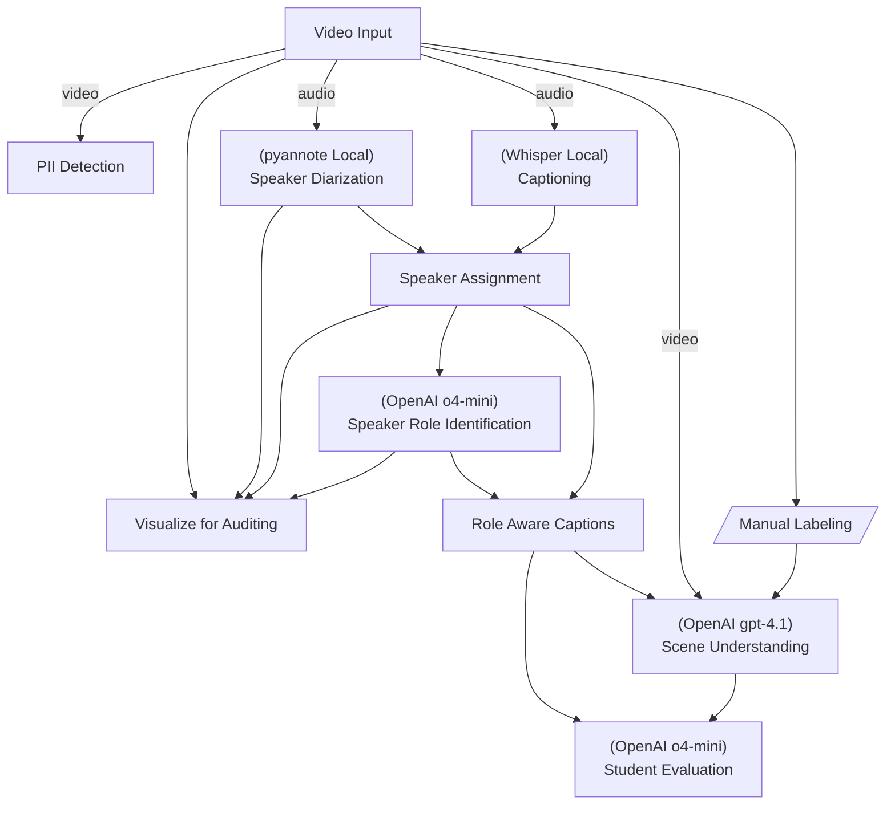
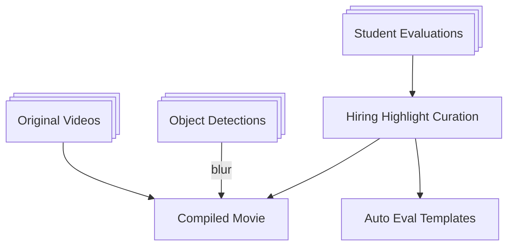

# Video Understanding & Summarization

This is a set of pipelines with which we create pipelines to understand, curate, and summarize a group of videos into a single 5 minutes highlight reel.

Specific application demonstrated here assumes the videos are of teacher-student sessions, with multiple teachers and students. The summary generates one file for each student, across all the sessions he or she participated in.

This uses the [flow](../flow/README.md) architecture.

In particulare we use two different flows here.

## Video Flow
A flow that is run to process each video.


A brief explanation of some of the pipeline nodes is given below:


| Nodes                       | Explanation                                                                                                                                                                                           |
| --------------------------- | ----------------------------------------------------------------------------------------------------------------------------------------------------------------------------------------------------- |
| Captioning                  | Captioning of speech in videos. Captioning does not identify speakers.                                                                                                                                |
| Speaker Diarization         | Identifies *when* different speakers are talking, outputting time segments for each speaker. Done via pyannote models for voice activity detection, segmentation, and clustering of voice embeddings. |
| Speaker Assignment          | Using the diarization output, assigns speakers labels (e.g. SPEAKER_00, SPEAKER_01)  to the corresponding parts of the transcription.                                                                 |
| Speaker Role Identification | Associate speaker ids with roles given the context of the video.                                                                                                                                      |
| Summarization               | Summarize based on the audio given speaker roles and transcriptions.                                                                                                                                  |
| Visualization and Iteration | Visualization of the speaker roles is done as an overlay on the video.                                                                                                                                |
| Manual Labeling             | Done using https://github.com/hirak99/video-annotator to identify regions-of-interest in the vide.                                                                                                    |

## Student Flow
Once all the videos are processed, the following is run to summarize across videos.



## Running

### Setup

- Recommended Python version is 3.13.

If your version is lower and you are using Ubuntu, you can use the following commands to install Python 3.13 -

```sh
sudo apt install python3.13 python3.13-venv python3.13-dev
```

- Create a venv (with Python 3.13 or higher) and install these packages:
```sh
sudo apt install tesseract-ocr

pip install openai-whisper pyannote.audio \
    whisper-timestamped \
    moviepy opencv-python \
    pytesseract easyocr \
    dotenv pydantic

pip install --upgrade openai
```
- Put all your videos in a path and edit video_processor.py to point to it.
- Obtain a token from HuggingFace to use public domain models that require authentication.
- Install ffmpeg.

### Video Annotation

Manual labels are done using https://github.com/hirak99/video-annotator.

See the constants in video_annotations_manager.py to understand where the labels are stored, what should be the user for labeling and what should be the names.

If you are not using manual labels, set the constant there to disable attempting to look up the labels.

### Local LLM Inference
For running local LLM models, following additional steps are required.

Skip if you don't need local infernce, e.g if you only use cloud-based LLMs.

```sh
sudo apt install cmake libcurl4-openssl-dev

# This requires an interactive prompt with EULA to be accepted.
sudo apt install ttf-mscorefonts-installer

# Install or update CUDA. E.g. for WSL-Ubuntu, follow instructions here -
# https://developer.nvidia.com/cuda-downloads?target_os=Linux&target_arch=x86_64&Distribution=WSL-Ubuntu&target_version=2.0&target_type=deb_network
# Important - add the new cuda to path. E.g. -
# PATH="/usr/local/cuda-12.9/bin:$PATH"

cd ~/git
git clone https://github.com/ggerganov/llama.cpp
cd llama.cpp
cmake -B build -DGGML_CUDA=ON
cmake --build build --config Release -j 8
```

Then download the models you need into `~/data/models`.

Note: To ensure that the local instance is automatically started when needed,
ensure that you have`AUTO_START_SERVER = True` in llm.py.
### Run the code
```sh
export FFMPEG_BINARY=/usr/bin/ffmpeg

# Note: The following may also be put in a .env file instead.
export HUGGING_FACE_AUTH="your huggingface token"  # Note: Remember to also accept pyannote terms of service in HuggingFace.
export OPEN_API_KEY="your OpenAI key"

# Edit consts in video_config.py.
# - Set input/output paths. If you modify them, also change the video_process.sh script.
# - Make sure TESTING_MODE is False.

# Edit llm.py.
# - Set AUTO_START_SERVER to True, assuming you want the framework to manage
#   starting and ending local LLM servers as needed.

# Then you can run a binary like below.

# Run each video file through video-understanding flow.
# The script is equivalent to invoking the python module, but also backs up past results.
./scripts/video_process.sh

# Run the student highlight compilation flow.
python -m src.bin.student_flow
```
