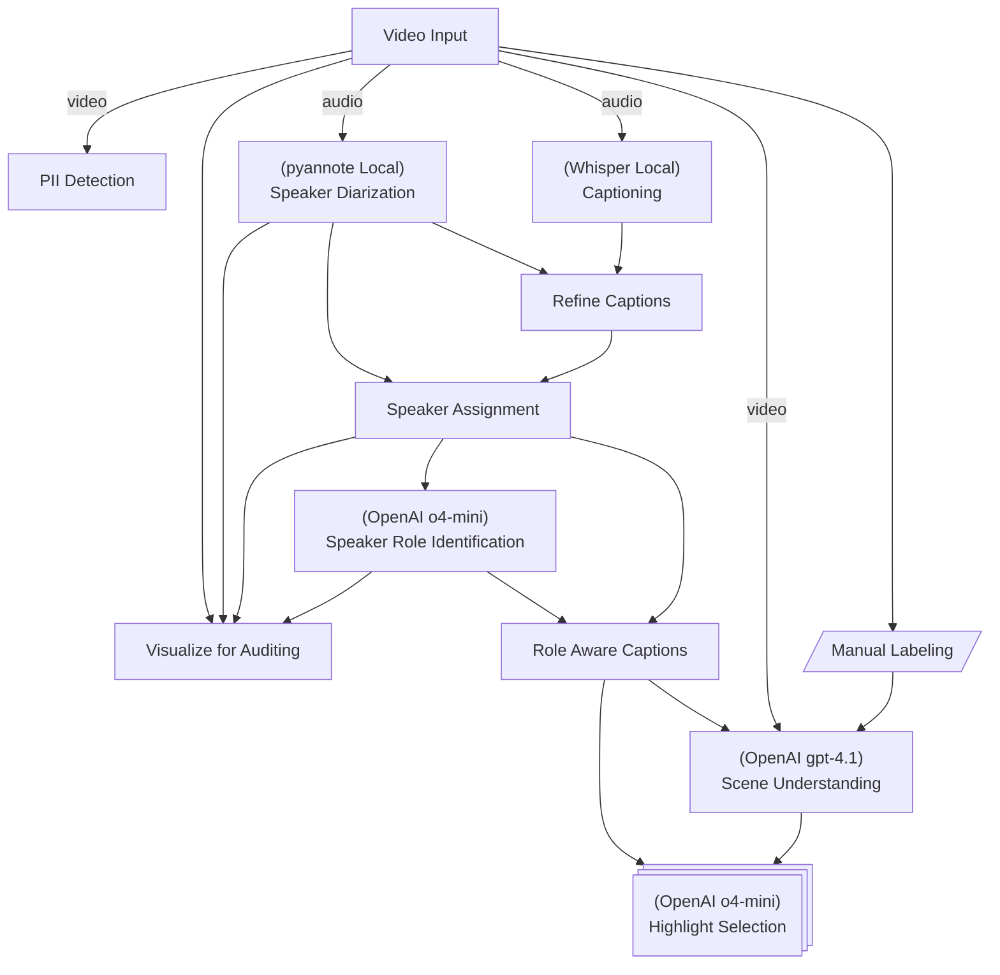
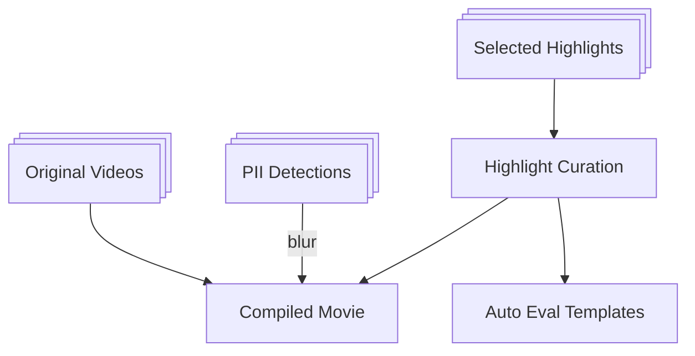
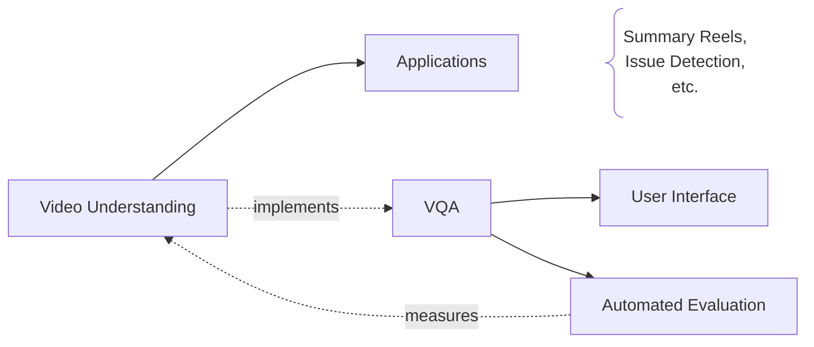

# Video Understanding & Summarization

This is a set of pipelines with which we create pipelines to understand, curate, and summarize a group of videos into a single 5 minutes highlight reel.

Specific application demonstrated here assumes the videos are of teacher-student sessions, with multiple teachers and students. The summary generates one file for each student, across all the sessions he or she participated in.

This uses the [flow](../flow/README.md) architecture.

In particular we use two different flows here.

## Video Flow
A flow that is run to process each video.

A brief explanation of some of the pipeline nodes is given below:

| Nodes                       | Explanation                                                                                                                                                                                           |
| --------------------------- | ----------------------------------------------------------------------------------------------------------------------------------------------------------------------------------------------------- |
| Captioning                  | Captioning of speech in videos. Captioning does not identify speakers.                                                                                                                                |
| Speaker Diarization         | Identifies *when* different speakers are talking, outputting time segments for each speaker. Done via pyannote models for voice activity detection, segmentation, and clustering of voice embeddings. |
| Speaker Assignment          | Using the diarization output, assigns speakers labels (e.g. SPEAKER_00, SPEAKER_01)  to the corresponding parts of the transcription.                                                                 |
| Speaker Role Identification | Associate speaker ids with roles given the context of the video.                                                                                                                                      |
| Summarization               | Summarize based on the audio given speaker roles and transcriptions.                                                                                                                                  |
| Visualization and Iteration | Visualization of the speaker roles is done as an overlay on the video.                                                                                                                                |
| Manual Labeling             | Done using https://github.com/hirak99/video-annotator to identify regions-of-interest in the vide.                                                                                                    |

## Student Flow
Once all the videos are processed, the following is run to summarize across videos.

## Video Question & Answering

Here's how VQA fits into the rest of the architecture -

- VQA uses an abstraction ([ref](./vqa/abstract_vqa.py)) that is independent of the rest of video understanding implementation. This removes mental barriers in evolving, or even replacing, the underlying system without being encumbered by VQA's implementation.

- While the abstraction is independent, VQA's implementation will be tied to specific video-understanding systems.

### Auto Eval

One primary usa case of VQA is to facilitate the automatic evaluation of our system.

This is achieved by setting up questions and precise answers at various points in test videos, which VQA can then process to come up with its own answers, and can be scored automatically.

### Demo

Below is a demo of Video Question Answering on an EKG training video.

